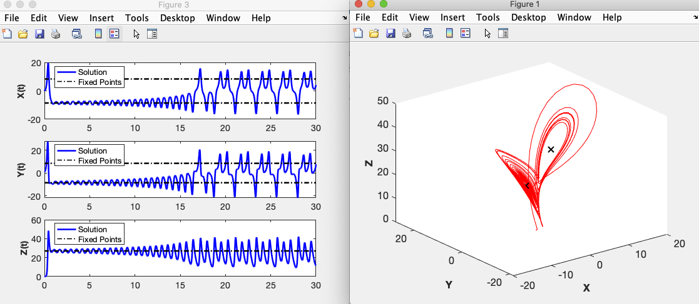

<h1>Numerical Tools for Phase Plane Analysis</h1>

This website is serves as as a way to distribute useful tools and software for my students in Math 412 (or any other course that deals with 2D dynamical systems). 
The goal is to provide help getting started with numerical tools for phase plane analysis. 
It will be updated as regularly as I can manage. 


<h2>Matlab</h2>

Matlab is a general purpose mathematics and computing environment sold by MathWorks.
As a UNM Student, you have access to a free download of Matlab with your UNM ID. 
To install it on your personal computing device, follow the instructions found on the UNM IT website [here](http://it.unm.edu/download/). 
I also have a brief tutorial on getting familiarized with Matlab on my website [here](https://owenlewis.github.io/MatlabTutorial/). 
If you've never used Matlab before, I suggest you begin there. 
It will help familiarize you with the path/directory system that Matlab utilizes, which is very important for what comes next. 


<h2>PPlane and DField</h2>

PPlane and Dfield are/were useful tools written in the Matlab programming language. 
Dfield can be used to visualize the phase line and solutions to one-dimensional dynamical systems.
PPlane is used to visualize the phase plane and solutions/trajectories of two-dimensional systems. 
They provide many other useful functions including but not limited to:
* Visualizing null-clines
* Finding fixed points
* Calculating the Jacobian (and eigenvalues/eigenvectors) at fixed points.
* Calculating "nearly closed" trajectories
* Exporting pictures of the phase plane and trajectories

Both tools can be downloaded from various places on the internet, including the [Matlab File Exchange](https://www.mathworks.com/matlabcentral/fileexchange/). 
Having said all of that, I do not suggest typing "pplane" into a search bar and blindly downloading whatever you find. 
The Matlab programming language has been updated regularly since 2017 when the original [author](https://math.rice.edu/~polking/odesoft/) of PPlane let the project drop. 
This means that using "original" PPlane with modern versions of Matlab will result in errors. 
Various community members have tried to fix these issues on their own, and the result has been a mess of competing implementations & versions sprawling across the internet. 
It's somewhat overwhelming, and actually the main reason I originally started this whole webpage. 
In the sections below you you will find a few options with relative benefits & drawbacks. 

<h3>Phase Plane and Slope Field App</h3>
This option is probably the most stable moving forward. 
Eventually the community outcry over the languishing state of PPlane caused an employee of Mathworks to take notice. 
The result is a "Matlab App" developed and maintained by Mathworks that reproduces most (if not all) of the functionality of PPlane. 
As of 2025 I have made the switch to this solution, and as I become more familiar with it (not every option is hiding in the same place as PPlane) I am learning to appreciate it more and more. 

I won't go through a lengthy tutorial on how to download and install the app, as the authors have done so on their GitHub page [here](https://github.com/MathWorks-Teaching-Resources/Phase-Plane-and-Slope-Field). 

<h3>Installing PPlane and DField</h3>
This option is probably the easiest, but possibly not the most stable moving forward. 
In the event that future changes to Matlab render this solution unusable, I will remove it. 

Below you will find my personal version of PPlane. 
I edited a single line in the original source file to ensure that it works with the most recent versions of Matlab (thanks to user Hil Meijer on the file exchange forums). 
I have tested in on Matlab version 2020 to 2023.
Hopefully it will continue to work for the forseeable future.
Download both files to your local computer (once you have Matlab installed). 
They can be found above ([pplane](https://github.com/OwenLewis/Spring21_Math412/blob/master/pplane8.m) and [dfield](https://github.com/OwenLewis/Spring21_Math412/blob/master/dfield8.m)).
It does not matter precisely which folder you place them in, but put them somewhere that you will remember and they will not get lost in the clutter. 
Open Matlab as you normally would. 
Navigate to the directory where you have saved pplane8.m and dfield8.m. 
This can be done one of two ways (see my [tutorial](https://owenlewis.github.io/MatlabTutorial/) for more details).
One option is to use commands in the "Command Window".
For example, you could type the command

```matlab
	cd ~/directory/where/pplane/is/located

```
and hit enter. 
Alternately, you could simply click the appropriate folders shown in the "Current Folder" window. 
The bar above the Command Window will show you which directory Matlab considers the "current directory" (shown in the red circle below). 
You will know you're in the correct directory when you see the appropriate files in the "Current Folder" window (shown in the green circle below).


Now you simply need to run the command
```matlab
	pplane8
```
and PPlane should fire right up (see screenshot). 
Happy phase-planing!


<h1>Self-Made Stuff</h1>
The rest of this page is dedicated to small Matlab functions and scripts that I have written to illustrate various concepts in Math 412. 
They are included here so that my students can download, modify, and play with them on their own time. They can also be modified/used to complete homework assignments if you wish. 

<h2>Lorenz_Explore</h2>
I have added my own file named "lorenz_explore.m" to the repository. 
It is designed to simply integrate the Lorenz equations for various parameter values and plot the results. 
The purpose is for you to explore the various behaviors that existing within this shockingly diverse dynamical system. 
To begin, download it as you would any of the other files in the repository, make sure the file is in the directory of your choice, and navigate to that directory in Matlab. 
If you ever forget how to use this program, you can type 

```matlab
	help lorenz_explore
```
and Matlab will print a small reminder for you (see screenshot). 


To run the program, you can call it with 7 arguments:
* The parameter r
* The parameter sigma
* The parameter b
* Your preferred initial condition for the x-coordinate
* Your preferred initial condition for the y-coordinate
* Your preferred initial condition for the z-coordinate
* The amount of time you wish to draw the solution for.

For example, you could type

```matlab
	lorenz_explore(28,10,8/3,0,1,0,30)
```

The program will numerically approximate the solution and plot two figures. 
Figure 1 will show the trajectory in 3-D phase space.
Figure 3 will show the x, y, and z components of the soluton as functions of time in three separate panels (along with some relevant fixed points).
See the screenshot below.


